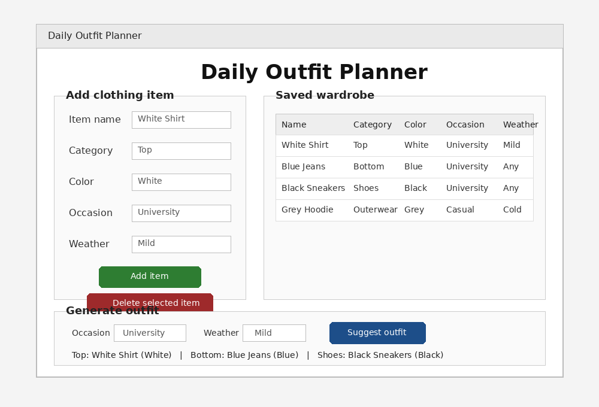

# Daily Outfit Planner

A simple Python desktop application that helps the user organize clothing items and generate a daily outfit suggestion based on occasion and weather.


## Project Idea

Many students waste time choosing what to wear every day. This app stores a small wardrobe list and suggests an outfit using saved items. The suggestion depends on two simple filters: occasion and weather.

## Features

- Add clothing items with name, category, color, occasion, and weather.
- Save all items in a JSON file so the data stays after closing the app.
- Display saved items in a table.
- Delete any selected item.
- Generate an outfit suggestion with Top, Bottom, and Shoes.
- Add Outerwear automatically for cold weather when available.

## Technologies Used

- Python 3
- Tkinter for the desktop GUI
- JSON for local data storage

## Project Files

| File | Purpose |
|---|---|
| `main.py` | Builds the application window and handles user actions |
| `data_handler.py` | Loads and saves wardrobe items in JSON |
| `outfit_engine.py` | Contains the outfit suggestion logic |
| `wardrobe_data.json` | Stores the saved clothing items |
| `requirements.txt` | Notes that no external packages are required |

## How to Run

1. Download or clone the repository.
2. Open the project folder in VS Code.
3. Make sure Python is installed.
4. Run this command in the terminal:

```bash
python main.py
```

If the command does not work on Windows, try:

```bash
py main.py
```

## Screenshot



## Known Limitations

- The outfit suggestion is based on simple rules, not a machine learning model.
- The app stores data locally on the same device only.
- There is no login system because the project is focused on basic programming and GUI skills.

## Future Improvements

- Add image upload for each clothing item.
- Add a color matching system.
- Add search and edit features.
- Add a calendar to plan outfits for different days.
